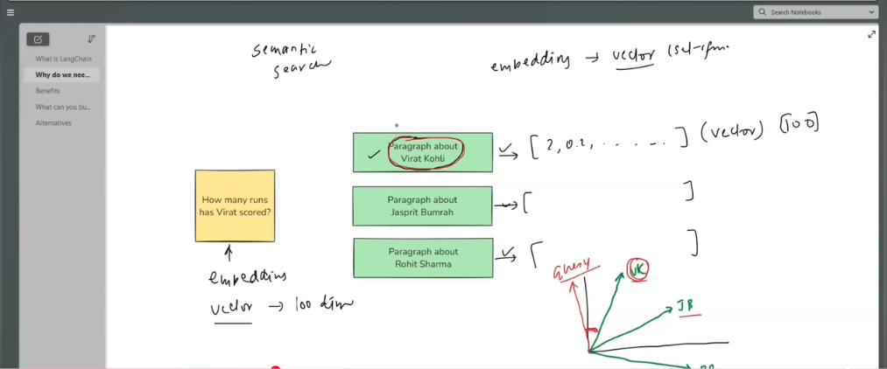

# In-Depth Explanation of Image 1: Semantic Search and Vector Embeddings in LangChain



---

## 1. Context and Slide Overview

The image represents a slide from a tutorial titled **"Why do we need LangChain?"** under the topic of **Semantic Search** and **Vector Embeddings**. 

When building applications with Large Language Models (LLMs), a major challenge is providing the model with accurate, relevant, and private or up-to-date data without exceeding token limits or incurring high latency and costs. This diagram illustrates the core mechanism behind **Information Retrieval (IR)** and **Retrieval-Augmented Generation (RAG)**: how human language is converted into numerical vectors to find semantically relevant knowledge for a user's question.

---

## 2. Key Components of the Diagram

### A. The User Query (Left Box)
* **Text in box**: `"How many runs has Virat scored?"`
* **Annotation**: `embedding` $\rightarrow$ `vector -> 100 dim`
* **Role**: 
  - Represents the runtime input submitted by an end-user.
  - Before searching the knowledge base, the query text is passed through an **Embedding Model**, which converts the phrase into a dense numerical vector of $N$ dimensions (illustrated in the diagram as a 100-dimensional vector).

---

### B. Knowledge Base Documents / Chunks (Center Green Boxes)
* **The Chunks**:
  1. **Chunk 1**: `"Paragraph about Virat Kohli"` *(Circled in red with a checkmark $\checkmark$)*
  2. **Chunk 2**: `"Paragraph about Jasprit Bumrah"`
  3. **Chunk 3**: `"Paragraph about Rohit Sharma"`
* **Vectors (Right of green boxes)**:
  - For Virat Kohli: $\rightarrow [2, 0.2, \dots] \text{ (vector) [100]}$
  - For Jasprit Bumrah: $\rightarrow [\dots]$
  - For Rohit Sharma: $\rightarrow [\dots]$
* **Role**:
  - Raw source texts (e.g., articles, cricket statistics, documents) are split into smaller paragraphs (chunks).
  - Each chunk is pre-processed through an embedding model and transformed into a 100-dimensional vector representation preserving its conceptual meaning.

---

### C. Vector Space and Geometric Similarity (Bottom-Right Coordinate System)
* **The 3D Coordinate Plane**:
  - Represents the high-dimensional vector space (projected onto 3 dimensions for human visualization).
  - Contains arrows representing vectors positioned according to semantic meaning:
    - **$\vec{\text{Query}}$ (Red Arrow)**: The user's query vector for *"How many runs has Virat scored?"*.
    - **$\vec{\text{VK}}$ (Green Arrow, Circled)**: The vector representing the *"Paragraph about Virat Kohli"*.
    - **$\vec{\text{JB}}$ (Green Arrow)**: The vector representing the *"Paragraph about Jasprit Bumrah"*.
    - **$\vec{\text{RS}}$ (Green Arrow)**: The vector representing the *"Paragraph about Rohit Sharma"*.
* **Angular Distance / Cosine Similarity**:
  - A red arc is drawn between $\vec{\text{Query}}$ and $\vec{\text{VK}}$, showing a very small angle ($\theta$).
  - A smaller angle corresponds to a higher **Cosine Similarity** ($\cos \theta \approx 1$).
  - Because both the query and the Virat Kohli chunk revolve around "Virat Kohli" and batting records, their vectors point in nearly the same direction in vector space.
  - In contrast, the vectors for Jasprit Bumrah ($\vec{\text{JB}}$, a bowler) and Rohit Sharma ($\vec{\text{RS}}$, a different batsman) point in different directions, yielding a larger angular distance and lower similarity score.

---

## 3. Step-by-Step Workflow Illustrated

```
+------------------------+
|  Document Knowledge    |
|  (Virat, Bumrah, etc.) |
+-----------+------------+
            |
            v  [Embedding Model]
+------------------------+
| Vector Store / Index   |  <--- Pre-computed Chunks stored as dense vectors
+-----------+------------+
            ^
            |  Vector Similarity Search (Cosine Similarity)
            |
+-----------+------------+
| Query: "How many runs  |
| has Virat scored?"     |
+------------------------+
            |
            v  [Embedding Model]
   Vector Representation
            |
            v
Top match identified: "Paragraph about Virat Kohli" (VK)
            |
            v
Context sent along with Query to LLM -> Accurate Answer Generated
```

1. **Ingestion & Indexing (Offline/Pre-processing)**:
   - Paragraphs about Virat Kohli, Jasprit Bumrah, and Rohit Sharma are converted into vectors using an embedding algorithm and indexed inside a Vector Database (e.g., Chroma, FAISS, Pinecone).
2. **Query Vectorization (Runtime)**:
   - When the user asks *"How many runs has Virat scored?"*, LangChain passes this query to the same embedding model, generating a 100-dimensional query vector.
3. **Similarity Calculation**:
   - The query vector is compared against all stored vectors using similarity metrics (such as Cosine Similarity or Dot Product).
4. **Nearest Neighbor Selection**:
   - The vector $\vec{\text{VK}}$ has the highest mathematical similarity to $\vec{\text{Query}}$.
   - The corresponding chunk (*"Paragraph about Virat Kohli"*) is selected ($\checkmark$).
5. **Prompt Augmentation (RAG)**:
   - LangChain injects this retrieved paragraph as context into the prompt sent to the LLM, enabling the model to formulate a factual answer based on real data without hallucinating.

---

## 4. Deep Dive: Embeddings, Semantic Search, and Why They Are Used

### A. What are Embeddings?

At their core, computers cannot inherently understand words, meaning, tone, or grammar—they only understand numbers. 

An **Embedding** is a technique in machine learning and Natural Language Processing (NLP) that converts unstructured human language (words, sentences, paragraphs, or entire documents) into a **dense vector of real numbers** (e.g., `[0.23, -0.45, 0.12, ..., 0.89]`) within a high-dimensional continuous mathematical space.

#### Key Characteristics of Embeddings:
1. **Meaning Encoded as Coordinates**: 
   - Words or sentences with similar meanings are assigned geometric coordinates that are close to each other in vector space.
   - For example, `dog` and `puppy` will be placed near each other; `cat` will be relatively close (both pets/animals), while `airplane` or `algebra` will be far away.
2. **Fixed Dimensionality**:
   - Regardless of whether the input text is a single word like `"Virat"` or a full paragraph, the embedding model transforms it into a fixed-length list of numbers (e.g., 100, 768, or 1536 floating-point values depending on the model, such as OpenAI `text-embedding-3-small` or HuggingFace `all-MiniLM-L6-v2`).
3. **Capture Mathematical Relationships (Vector Arithmetic)**:
   - Famous example: $\vec{\text{King}} - \vec{\text{Man}} + \vec{\text{Woman}} \approx \vec{\text{Queen}}$.
   - They capture gender, tense, geography, hierarchy, and domain relationships naturally.

---

### B. What is Semantic Search?

**Semantic Search** is a search technique that seeks to understand the **meaning (semantics)**, **intent**, and **context** behind a user's query, rather than merely matching literal strings or exact keywords.

#### Lexical/Keyword Search vs. Semantic Search:

| Feature | Traditional Keyword Search (BM25 / TF-IDF) | Semantic Search (Vector-Based) |
| :--- | :--- | :--- |
| **How it searches** | Matches exact words and character sequences. | Compares semantic concepts in vector space. |
| **Synonyms** | Fails unless explicitly configured with a thesaurus (e.g., fails if searching "automobile" when document says "car"). | Automatically resolves synonyms because their vectors point in nearly identical directions. |
| **User Intent** | Ignores context and intent; easily misled by ambiguous words. | Understands context (e.g., "apple phone" vs. "apple fruit"). |
| **Phrasing Variations** | Struggles with rephrased questions or varied grammar. | Matches rephrased queries effortlessly. |
| **Multilingual** | Requires translation layers to bridge languages. | Multilingual embeddings place `"cricket"` and `"क्रिकेट"` in the same semantic space. |

#### In the context of Image 1:
- Query: *"How many runs has Virat scored?"*
- Document text: *"Paragraph about Virat Kohli"*
- A keyword search might fail if the document writes: *"Kohli's career aggregate: 26,000 international runs"* (missing the exact token "Virat").
- **Semantic search succeeds** because the embedding captures that the query is asking about Virat Kohli's batting statistics, aligning with the document's vector $\vec{\text{VK}}$.

---

### C. Why are Embeddings and Semantic Search Used?

Modern AI and LLM architectures rely on embeddings and semantic search for several critical reasons:

#### 1. Powering Retrieval-Augmented Generation (RAG)
LLMs have fixed knowledge cutoffs and cannot store every private enterprise document or live database in their pre-trained weights. RAG uses semantic search to fetch only the most relevant snippets from external documents and feed them to the LLM at inference time.

#### 2. Overcoming Context Window Limits and Cost
Feeding thousands of pages into an LLM prompt for every question is impossible or prohibitively expensive and slow. Semantic search narrows down millions of words into the exact 1–3 paragraphs needed, saving time, compute tokens, and API costs.

#### 3. Preventing LLM Hallucinations
When an LLM doesn't have verified data, it may fabricate facts (hallucinate). Grounding the LLM with relevant facts retrieved through semantic search ensures factual, traceable answers.

#### 4. Handling Ambiguity and Real-World Human Queries
Users rarely phrase questions using the exact terminology present in company manuals or databases:
- User asks: *"How do I fix a leaking faucet?"*
- Manual contains: *"Replacing the worn neoprene washer in the cartridge assembly."*
- Embeddings bridge the lexical gap between human speech and technical documentation.

#### 5. Mathematical Basis: Measuring Similarity
Once text is converted to vectors $\mathbf{A}$ (query) and $\mathbf{B}$ (document), calculating similarity is a straightforward geometric operation. The most common metric is **Cosine Similarity** ($\cos \theta$):

$$\text{Cosine Similarity} = \cos(\theta) = \frac{\mathbf{A} \cdot \mathbf{B}}{\|\mathbf{A}\| \|\mathbf{B}\|} = \frac{\sum_{i=1}^{n} A_i B_i}{\sqrt{\sum_{i=1}^{n} A_i^2} \sqrt{\sum_{i=1}^{n} B_i^2}}$$

- **$\theta \to 0^\circ \implies \cos(\theta) \to 1$**: Vectors point in the same direction (high semantic relevance, as seen with $\vec{\text{Query}}$ and $\vec{\text{VK}}$).
- **$\theta \to 90^\circ \implies \cos(\theta) \to 0$**: Vectors are orthogonal (unrelated, as seen with $\vec{\text{Query}}$ and $\vec{\text{JB}}$).

---

## 5. How LangChain Automates This in Code

LangChain provides ready-to-use abstractions for each step shown in Image 1:

```python
from langchain_community.document_loaders import TextLoader
from langchain_text_splitters import CharacterTextSplitter
from langchain_openai import OpenAIEmbeddings
from langchain_community.vectorstores import FAISS
from langchain.chains import create_retrieval_chain
from langchain.chains.combine_documents import create_stuff_documents_chain
from langchain_core.prompts import ChatPromptTemplate
from langchain_openai import ChatOpenAI

# 1. Documents (Green Boxes)
docs = [
    "Virat Kohli is an Indian international cricketer with over 25,000 international runs...",
    "Jasprit Bumrah is an Indian fast bowler known for his lethal yorkers...",
    "Rohit Sharma is the captain of the Indian cricket team and a prolific opening batsman..."
]

# 2. Embedding Model (Converts text -> Vectors)
embedding_model = OpenAIEmbeddings()

# 3. Vector Store (Stores vectors in vector space)
vector_db = FAISS.from_texts(texts=docs, embedding=embedding_model)

# 4. User Query
query = "How many runs has Virat scored?"

# 5. Semantic Search (Finds nearest vector: VK)
retriever = vector_db.as_retriever(search_kwargs={"k": 1})
matched_docs = retriever.invoke(query)

print("Top matched document:")
print(matched_docs[0].page_content)
```

---

## 6. Summary: Why This Explains "Why We Need LangChain"

| Challenge without LangChain | How LangChain Solves It (As Shown in Image 1) |
| :--- | :--- |
| **Manual vector calculations** | Automates embedding generation via standard interfaces (`Embeddings`). |
| **Handling chunking & indexing** | Provides built-in text splitters and connections to 50+ vector databases. |
| **Query orchestration** | Automatically transforms incoming queries into vectors, calculates cosine distance, and extracts the top $K$ relevant chunks. |
| **Context feeding** | Chains the retrieved documents into prompt templates and delivers them to the LLM for grounded answer generation. |
